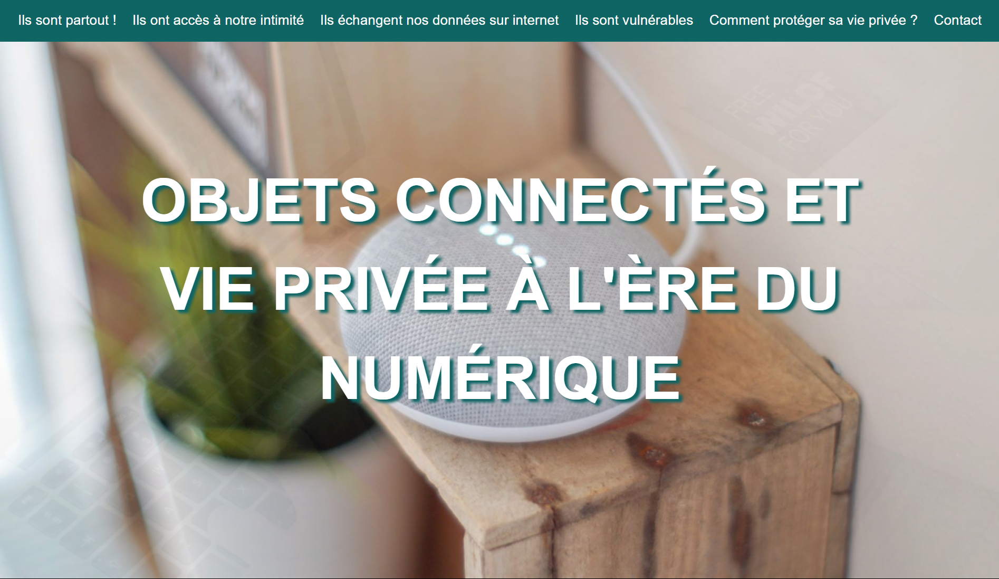

# objetsconnectes-et-vieprivee

Salut tout le monde ! Je suis Jessica Elessa, et j'ai créé le projet suivant dans le cadre de ma première certification en développement web chez Simplon. L'objectif est de sensibiliser le public à l'impact croissant des objets connectés sur la vie privée à l'ère du numérique.

## Table des matières

1. [Démo](#demo)
2. [Technologies utilisées](#technos)
3. [Capture d'écran](#screenshot)
4. [Comment exécuter le projet localement ?](#executer)
5. [Contact](#contact)

## Démo

Vous pouvez explorer le site web [ici](https://jesselessa.github.io/objetsconnectes-et-vieprivee/).

## Technologies utilisées

J'ai développé ce site avec HTML, CSS et JavaScript.

## Capture d'écran

## Comment exécuter le projet localement ?

1. Clonez le dépôt : `git clone https://github.com/jesselessa/objetsconnectes-et-vieprivee.git`
2. Accédez au répertoire du projet : `cd objetsconnectes-et-vieprivee`
3. Ouvrez le fichier `index.html` dans votre navigateur.

## Contact 

Pour toute question ou interaction, n'hésitez pas à me contacter via [LinkedIn](https://www.linkedin.com/in/jesselessa/).

---

&copy; 2021, Jessica ELESSA - Tous droits réservés
